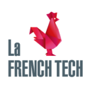
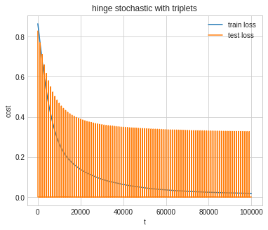
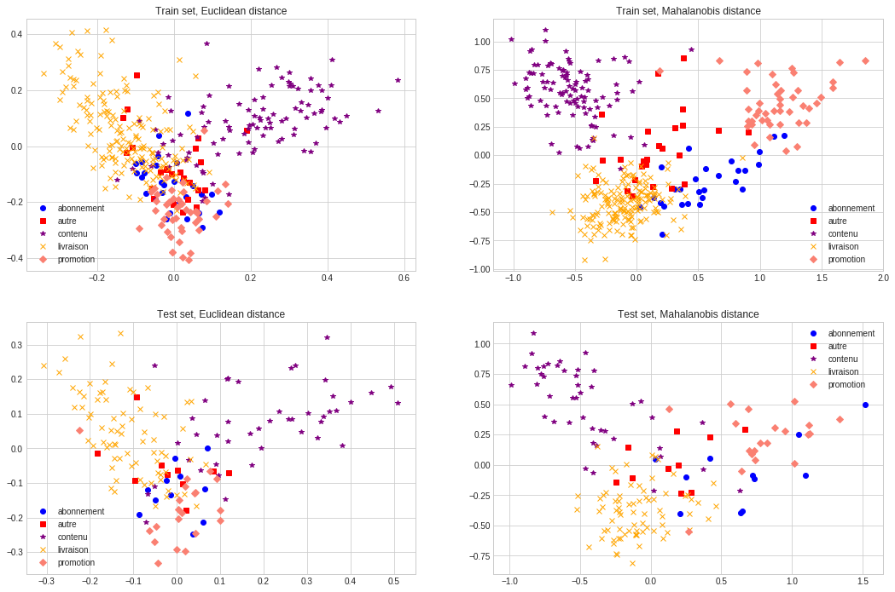
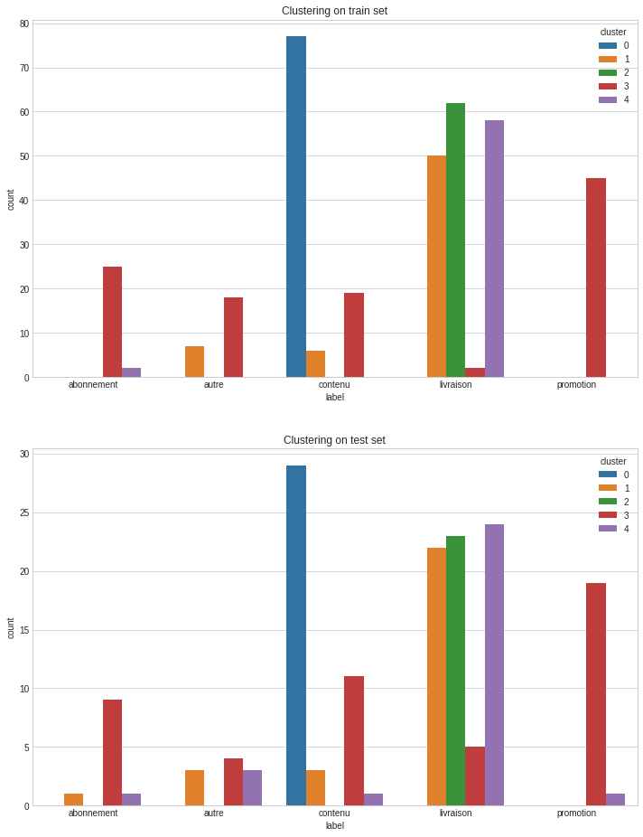
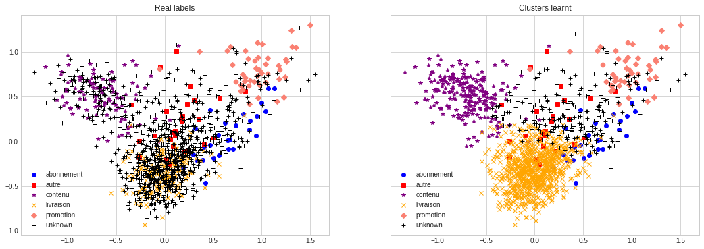
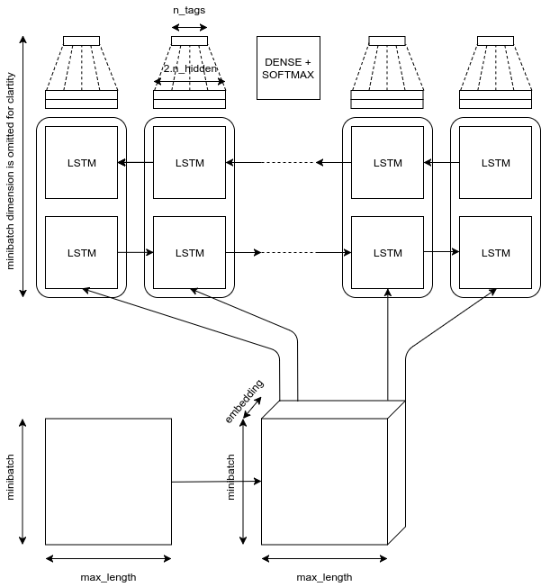
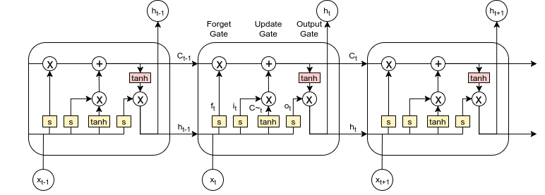
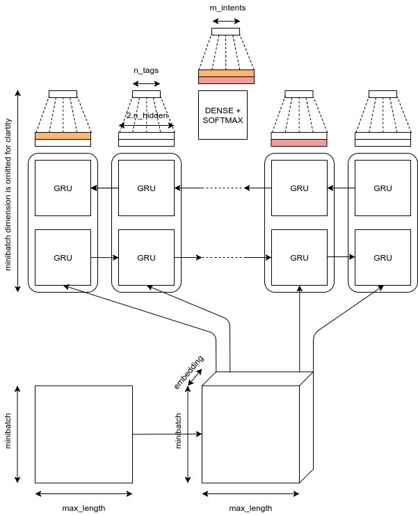

# SouthPigalle

Thèse professionnelle de François Lecerf

Présentation du 21/01/2019

---
@snap[north-west]
## Présentation
@snapend

@snap[center]
@ul
- La société SouthPigalle
- Labellisation semi-supervisée
- Reconnaissance d'entités nommées
- Semantic Slot Filling et reconnaissance d'intents
@ulend
@snapend

---
## La société SouthPigalle
---
@ul
- Start-up fondée en 2015
- Levier de création de valeur: le texte
- Membre de la French Tech,
  - LVMH: la maison des start-up
  - La Fabrique(l'usine.io)
  - Partenaire Microsoft
@ulend

@snap[south-east]

@snapend

---
## Labellisation semi-supervisée
---
@snap[north-west]
### Principe
@snapend

@snap[center]
@ul
- 400 données annotées
- Labelliser automatiquement les observations similaires
- Labelliser manuellement les observations ambigües
- Effectuer ces opérations de façon contrôlée
- Prédire l'intent sur deux datasets clients: My Little Box, GameLoft
@ulend
@snapend
---
@snap[north-west]
### Méthode
@snapend

@snap[center]
@ul
- **Metric learning**: embedding séparant bien les observations annotées
- **Clustering spectral**: clusters homogène
- **Train**: objectifs
 - **ML** avoir des classes bien séparées
 - **CS** avoir des clusters homogènes (précision)
- **Test**: vérifier que le modèle se généralisera bien
- Propager les labels sur les clusters dont la précision sur la classe majoritaire est supérieure à un seuil
@ulend
@snapend
---
@snap[north-west]
### Metric learning
@snapend

@ul
- Apprentissage d'une pseudo-distance
- Utilisation d'une perte de type triplet loss
- Gradient stochastique avec minibatches
- Projection des observations dans le nouvel espace
@ulend

---
@snap[north-west]
### Metric learning - MLB - LOSS
@snapend

@snap[center]

@snapend
---
@snap[north-west]
### Metric learning - MLB - AUC SCORE
@snapend

@snap[center]

@snapend
---
@snap[north-west]
### Metric learning - MLB - NOUVEL ESPACE
@snapend

@snap[center]

@snapend
---
@snap[north-west]
### Clustering spectral
@snapend

@ul
- Création d'un graphe sparse (plus proches voisins)
- Construction du Laplacien normalisé
- Calculs des derniers vecteurs propres
- Projection des observations et clustering
@ulend
---
@snap[north-west]
### Clustering spectral - MLB - Spectre du Laplacien
@snapend

@snap[center]

@snapend
---
@snap[north-west]
### Clustering spectral - MLB - Clustering
@snapend

@snap[center]

@snapend
---
@snap[north-west]
### Clustering spectral - MLB - Propagation de labels
@snapend

@snap[center]

@snapend
---
## Reconnaissance d'entités nommées
---
@snap[north-west]
### Architecture
@snapend

@snap[west span-50]
@ul
- Tokenization
- Embedding layer
- Bi-LSTM
- Fully connected
- Cross-entropy
@ulend
@snapend

@snap[east span-50]

@snapend
---
@snap[north-west]
### La cellule LSTM
@snapend

@snap[west span-50]
@ul
- Contexte partagé
- Forget Gate
- Update Gate
- Output Gate
@ulend
@snapend

@snap[east span-50]

@snapend

---
## Semantic Slot Filling et reconnaissance d'intents
---
@snap[north-west]
### Architecture
@snapend

@snap[west span-50]
@ul
- Similaire au NER
- Features pour l'intent: concatenation des dernières hidden state
- Une loss pour les slots
- Une loss pour les intents
- A mitiger !
@ulend
@snapend

@snap[east span-50]

@snapend
---
## Add Some Slide Candy

---
@title[Customize Slide Layout]

@snap[west span-50]
## Customize Slide Content Layout
@snapend

@snap[east span-50]

@snapend

---?color=#E58537
@title[Add A Little Imagination]

@snap[north-west]
#### Add a splash of @color[cyan](**color**) and you are ready to start presenting...
@snapend

@snap[west span-55]
@ul[spaced text-white]
- You will be amazed
- What you can achieve
- *With a little imagination...*
- And **GitPitch Markdown**
@ulend
@snapend

@snap[east span-45]
@img[shadow](assets/img/conference.png)
@snapend

---?image=assets/img/presenter.jpg

@snap[north span-100 headline]
## Now It's Your Turn
@snapend

@snap[south span-100 text-06]
[Click here to jump straight into the interactive feature guides in the GitPitch Docs @fa[external-link]](https://gitpitch.com/docs/getting-started/tutorial/)
@snapend
