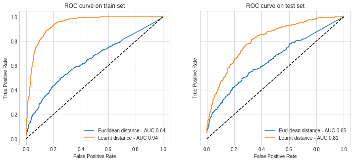
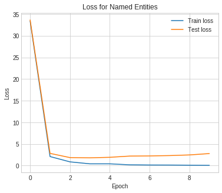

# SouthPigalle

Thèse professionnelle de François Lecerf

Présentation du 21/01/2019

---
@snap[north-west]
## Présentation
@snapend

@snap[center]
@ul
- La société SouthPigalle
- Labellisation semi-supervisée
- Reconnaissance d'entités nommées
- Semantic Slot Filling et reconnaissance d'intents
@ulend
@snapend

---
## La société SouthPigalle
---
@ul
- Start-up fondée en 2015
- Levier de création de valeur: le texte
- Membre de la French Tech,
  - LVMH: la maison des start-up
  - La Fabrique (L'usine.io)
  - Partenaire Microsoft
@ulend

@snap[south-east]

@snapend

---
## Labellisation semi-supervisée
---
@snap[north-west]
### Principe
@snapend

@snap[center]
@ul
- 400 données annotées
- Labelliser automatiquement les observations similaires
- Labelliser manuellement les observations ambigües
- Effectuer ces opérations de façon contrôlée
- Prédire l'intent sur deux datasets clients: My Little Box, GameLoft
@ulend
@snapend
---
@snap[north-west]
### Méthode
@snapend

@snap[center]
@ul
- **Metric learning**: embedding séparant bien les observations annotées
- **Clustering spectral**: clusters homogène
- **Train**: objectifs
 - **ML** avoir des classes bien séparées
 - **CS** avoir des clusters homogènes (précision)
- **Test**: vérifier que le modèle se généralisera bien
- Propager les labels sur les clusters dont la précision sur la classe majoritaire est supérieure à un seuil
@ulend
@snapend
---
@snap[north-west]
### Metric learning
@snapend

@ul
- Apprentissage d'une pseudo-distance
- Utilisation d'une perte de type triplet loss
- Gradient stochastique avec minibatches
- Envoi des observations dans le nouvel espace
@ulend

---
@snap[north-west]
### Metric learning - MLB - Loss
@snapend

@snap[center]

@snapend
---
@snap[north-west]
### Metric learning - MLB - AUC score
@snapend

@snap[center]

@snapend
---
@snap[north-west]
### Metric learning - MLB - Nouvel espace
@snapend

@snap[center]

@snapend
---
@snap[north-west]
### Clustering spectral
@snapend

@ul
- Création d'un graphe sparse (plus proches voisins)
- Construction du Laplacien normalisé
- Calculs des derniers vecteurs propres
- Projection des observations et clustering
@ulend
---
@snap[north-west]
### CS - MLB - Spectre du Laplacien
@snapend

@snap[center]

@snapend
---
@snap[north-west]
### Clustering spectral - MLB - Clustering
@snapend

@snap[west]
@ul
- Cl | Top | Precision | Ratio |
- 0 | contenu | 1 | 0.18 |
- 2 | livraison | 1 | 0.14 |
- 4 | livraison | 0.8 | 0.15 |
- 1 | livraison | 0.76 | 0.14 |
- 3 | promotion | 0.40 | 0.12 |
@ulend
@snapend

@snap[south-east]

@snapend
---
@snap[north-west]
### CS - MLB - Propagation de labels
@snapend

@snap[center]

@snapend
---
## Reconnaissance d'entités nommées
---
@snap[north-west]
### Architecture
@snapend

@snap[west span-50]
@ul
- Tokenization
- Mini batches
- Embedding layer
- Bi-LSTM
- Fully connected
- Cross-entropy
@ulend
@snapend

@snap[east span-50]

@snapend
---
@snap[north-west]
### La cellule LSTM
@snapend

@snap[west span-50]
@ul
- Contexte partagé
- Forget Gate
- Update Gate
- Output Gate
@ulend
@snapend

@snap[east span-50]

@snapend

---
@snap[north-west]
### NER - RCV2 - Tensorboard
@snapend

@snap[center]

@snapend
---
@snap[north-west]
### NER - RCV2 - Loss
@snapend

@snap[center]

@snapend
---
@snap[north-west]
### NER - RCV2 - SGD
@snapend

@snap[center]

@snapend
---
@snap[north-west]
### NER - RCV2 - Score F1 macro
@snapend

@snap[center]

@snapend
---
@snap[north-west]
### NER - RCV2 - Messages hors contexte
@snapend

@snap[center]

@snapend
---
## Semantic Slot Filling et reconnaissance d'intents
---
@snap[north-west]
### Architecture
@snapend

@snap[west span-50]
@ul
- Similaire au NER
- Features pour l'intent: concatenation des dernières hidden state
- Une loss pour les slots
- Une loss pour les intents
- A mitiger !
@ulend
@snapend

@snap[east span-50]

@snapend
---
@snap[north-west]
### SSF - ATIS - Loss
@snapend

@snap[center]

@snapend
---
@snap[north-west]
### SSF - ATIS - Macro score
@snapend

@snap[center]

@snapend
---
@snap[north-west]
### SSF - ATIS - Predictions
@snapend

@snap[center]

@snapend
---
# Conclusion
---
@snap[north-west]
## Conclusion
@snapend
@snap[center]
@ul
- Secteur très riche en terme de cas d'utilisation
- Complet d'un point de vue des techniques de ML
- En pleine explosion
@ulend
@snapend
